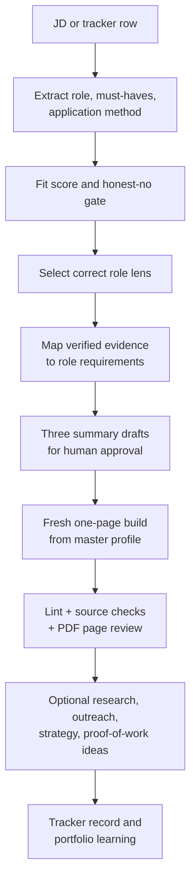

> A controlled decision and document-production system for serious applications. Given a verified evidence base and a job description, it decides what should lead, what should be cut, and where human judgement has to stay in the loop.

Workflow

## ⚡ The gist

- What it is: an operating system for job applications. It treats an application as a controlled selection problem, not a writing task.
- What I built: a pipeline that triages the opportunity, reframes verified experience for the specific role, drafts the highest-risk section for my approval, and builds a tailored one-page resume.
- The hard part: making it personal enough that a recruiter sees the fit, while controlled enough that it never becomes a keyword-stuffed, near-cloned, AI-written resume.

## 🔍 The detail

### The problem

- A generic resume asks a recruiter to infer relevance. An unconstrained AI rewrite creates the opposite risk: it can sound tailored while quietly changing scope, metrics, ownership, or the real story of my experience.
- The answer is not one giant prompt. It is a set of explicit gates and decision rights that hold the line where an AI can do reputational damage.

### The operating model

- **Verified master profile** — the facts, dates, metrics, and work examples. It keeps the evidence base stable, so old resumes are never allowed to contaminate a new application.
- **Role lenses** — what should lead for a specific role family, so the same truthful background can be reframed without becoming inconsistent.
- **Summary contract and approval gate** — the highest-risk narrative section. The system presents three full summary drafts, then waits for my decision before building any files.
- **Rule inventory and file ownership** — 50+ interdependent design rules, each with a named source of truth, so different instructions cannot quietly contradict each other.
- **Deterministic builder and QA** — one-page DOCX/PDF output with source tracing, a content lint, and a visual page check, so every result is readable, ATS-safe, traceable, and genuinely one page.
- **Tracker and dependency engine** — what to research, produce, and learn from each application, so the system does not do expensive work by default but still keeps a record that improves over time.

### The rules that matter most

- Never fabricate; build fresh from the master profile.
- Stop weak-fit applications at the honest-no threshold unless I override.
- Mirror job-description language only when it means the same real work.
- Never build the final files before summary approval.
- Do not distort formatting to force a one-page result.
- Draft outreach, but never send it.

### What it adds up to

- The workflow turns an application from a one-off writing task into a repeatable operating process: triage the opportunity, surface the genuine objection, decide the research depth, build the tailored one-page resume, and preserve the result and outcome in one place.
- The complexity is not ornamental. It solves a real coordination problem between evidence, judgement, writing, document production, and learning — automating the repeatable structure while holding human control at the consequential moments.
