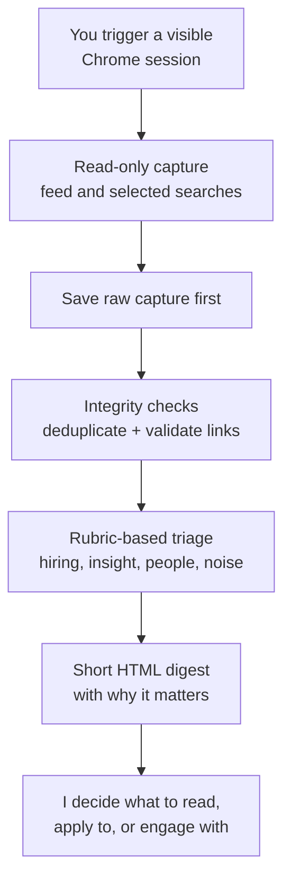

> A read-only research assistant for a high-noise professional feed. It collects what is visible in my own browser, ranks it against my interests and job search, and gives me a short digest of what is actually worth opening.

Workflow

## ⚡ The gist

- What it is: an attention filter for LinkedIn. Hiring signals, useful thinking, recycled AI content, ads, and social noise all arrive in the same feed — this pulls out the small share that is actually worth my time.
- What I built: a supervised, read-only workflow that captures what is on screen in my signed-in browser, ranks it against my interests and job search, and produces a short digest of what to open.
- The hard part: keeping it genuinely bounded. The right design here is not a bot that does everything — it is a reliable filter that stops before taking any action that should stay a human decision.

## 🔍 The detail

### The problem

- LinkedIn is useful, but the return on manual scrolling is poor. The genuinely valuable posts are buried in a feed built to keep me scrolling, not to surface what matters to my search.
- I did not want an autonomous agent acting on my behalf. Liking, commenting, connecting, or applying are consequential — those judgements should stay with me.

### How I built it

- Supervised and visible. The system works in my own signed-in Chrome session, with me starting the run and able to watch it happen. Nothing runs unattended in the background.
- Read-only by design. It does not like, comment, connect, or visit profiles. It collects, analyses, and stops.
- Save-first capture. Raw content is written to disk before anything is judged, so a refresh or interruption never destroys a research pass.
- Rubric-based triage. Posts are scored against a clear rubric — hiring signals, genuine insight, people I deliberately follow, and noise — rather than by engagement.
- A challenge stop condition. If the platform presents a checkpoint or challenge, the system stops instead of trying to work around it.

### What it adds up to

- Instead of treating every post as equally worth attention, the workflow produces a small review queue: roles worth applying to, ideas worth reading, and posts from people I chose to follow.
- The project has a supervised feed lane and a complementary content-search lane. It is designed for human-triggered use, not unattended scraping or autonomous engagement.
- It is a clear example of where the right AI design is deliberately limited: automate the collection, triage, and synthesis; leave the consequential human actions with the human.
