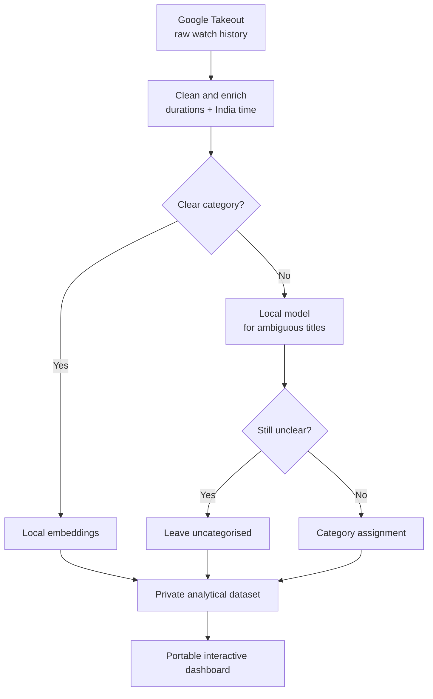

> I consume a lot of YouTube, and wanted to analyse my usage patterns. So I extracted a year of watch history and turned it into a dashboard to see where my attention actually goes — all analysed locally on my laptop.

Workflow

## ⚡ The gist

- What it is: a personal analytics dashboard built from a year of my own Google Takeout export.
- Why I built it: I use YouTube heavily and wanted an honest picture of how I had actually been spending that time.
- What I built: a pipeline that cleans the export, estimates watch time, sorts thousands of videos by intent, and renders an interactive report.
- The stack: Python and pandas, local embeddings, a local model through Ollama, and one self-contained HTML dashboard. Nothing leaves my machine.

## 🔍 The detail

### The problem

- I watch a lot of YouTube and had a vague sense it was more than I would like. I wanted the real picture, not a guess.
- Google Takeout gives you a mess: every video you opened, thousands of rows, no durations, no categories, and nothing that means much on its own.
- To make it useful, I needed to estimate watch time, categorise videos by intent, and separate Shorts from long-form viewing — without sending my history to an API.

### How I built it (cheapest thing first)

- Ingest and enrich: parse the export, attach durations, and convert timestamps to India time.
- Categorise in two tiers. Local embeddings sort the obvious cases for free; a local model only sees the genuinely ambiguous titles.
- Leave the unclear cases alone. Spam, livestreams, and anything that does not fit stay uncategorised — about 8% does. I would rather leave it open than force it into the wrong box.
- Keep the accounting honest. Watch hours are estimates: a fraction of each video's length, capped, counted once, with Shorts left out of the totals. The dashboard says so plainly.

### Under the hood

- The two-tier approach keeps it cheap. Embeddings do most of the work, while the model only handles the leftovers.
- Data sits as Parquet between stages, and the final report is one portable HTML file.
- The dashboard includes category drill-downs, a when-I-watch heatmap, session and binge detection, a freshness view for how old a video is when I press play, Shorts versus long-form viewing, and a what-leads-to-what matrix.

### What it showed

- It was a little humbling. I graze more than I settle, and it takes a lot of channels to cover most of what I watch. Startup and business is my biggest deliberate category, and there is a clear late-night band.
- It is applied AI and data work with some judgment behind it: spend compute where it counts, keep sensitive data private, and be clear about what is an estimate and what is not.
